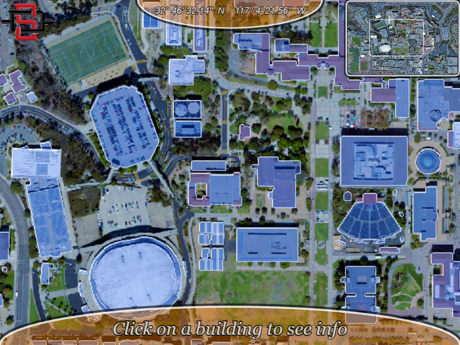

## SDSU interactive campus map

Front-end map application of San Diego State University's campus with zooming, panning, building detection and map extent functionalities. All of the functionalities are created with image manipulation using Javascript. The application uses [p5.js](https://p5js.org/) library.

The application is deployed [here](https://khholst.github.io/SDSU-campus-map/)

